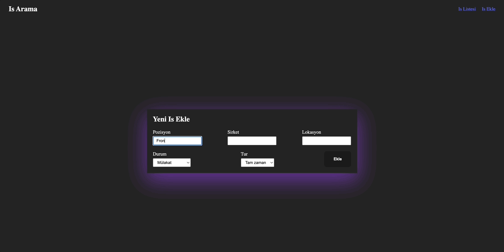

<h1>Redux-Toolkit job service app</h1>

A tool for registering jobs,location,status of job applications

<h2>Used techniques in this project</h2>

With redux toolkit managed the states. Via Axios fetched the data from Json-server.    

<h2> Screen gif of final result</h2>

